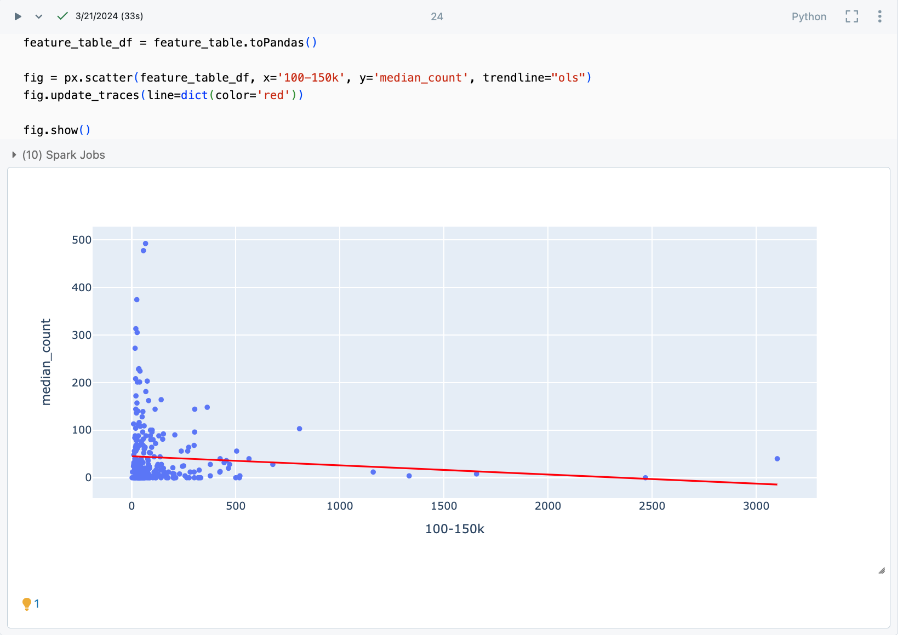
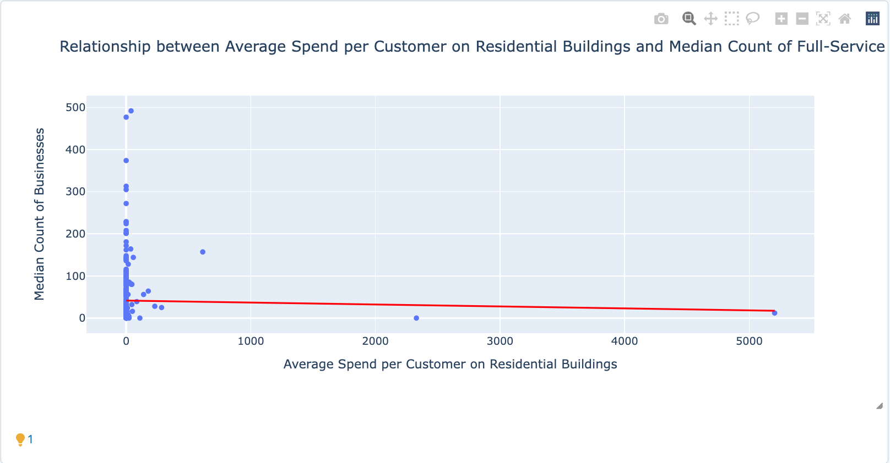
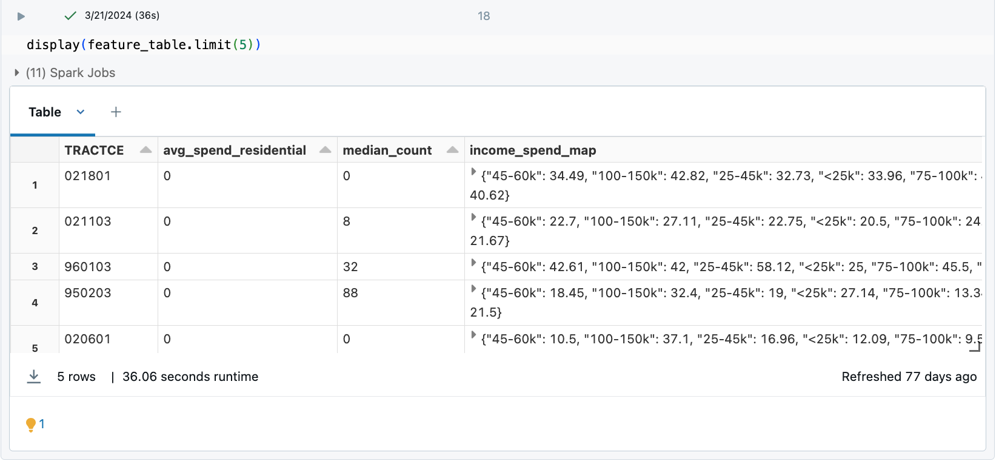
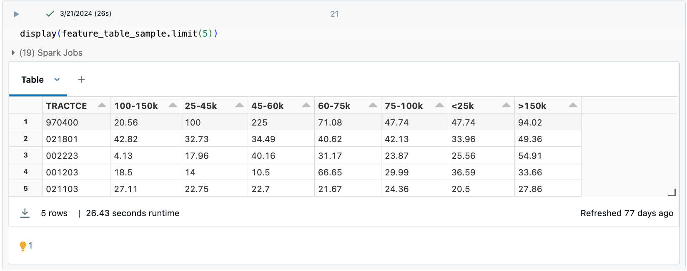

# PySpark Feature Development

## Overview
This repository contains PySpark scripts used for data processing and feature development with datasets from the US Census Bureau. The primary focus is to develop insightful features that help understand spending patterns in residential real estate and map customer spending based on income ranges.

## Data
Data used in this project is sourced from the US Census Bureau, focusing on areas related to residential buildings and dwellings.

## Features

### Average Spend Residential

This feature, named "Average Spend per Customer on Residential Buildings and Dwellings," aims to quantify the average monetary expenditure by customers on residential properties within different areas. The process includes filtering data related to residential businesses, calculating average spending, and integrating this data with business counts in respective areas. 

#### Development Steps:
```plaintext
1. Filtered `poi_spend_visits` to include only entries with NAICS code 531110 (residential rental businesses).
2. Grouped the data by area (`TRACTCE`) and computed the average spend per customer.
3. Merged this data with `target` data that contains the number of businesses per area.
4. Handled missing values by filling them with zeros and sorted the data by area.
```


```pyspark
feature_table = poi_spend_visits.filter(F.col("NAICS_CODE") == "531110") \
            .groupBy('TRACTCE') \
            .agg(F.avg("MEDIAN_SPEND_PER_CUSTOMER").alias("avg_spend_residential")) \
            .withColumn('avg_spend_residential', F.round(F.col('avg_spend_residential'), 2)) \
            .join(target, on="TRACTCE", how="right") \
            .na.fill(0) \
            .select("TRACTCE", "avg_spend_residential", "median_count") \
            .sort(F.asc("TRACTCE"))
```


#### Income Spend Map
The "Income Spend Map" feature provides insights into average customer spending based on various income ranges, enhancing understanding of economic behavior across different demographics.

Development Steps:
```plaintext
1. Extract income data by exploding the `BUCKETED_CUSTOMER_INCOMES` column into separate entries for income ranges and their values.
2. Similarly, extract spend data by exploding the `MEAN_SPEND_PER_CUSTOMER_BY_INCOME` column.
3. Join the unmapped income and spend data on "TRACTCE" and "income", group by "TRACTCE", and pivot on "income" to create columns for each income range.
4. Aggregate spend values using the first encountered value for each income range.
5. Create a map pairing each income range with its corresponding spend value using `create_map()`.
6. Merge this map with `feature_table` to include the income spend map for each region.
7. Fill any missing values with zeros post-join to ensure data completeness.
```


```pyspark
from pyspark.sql import functions as F

unmapped_incomes = poi_spend_visits.select(
    F.col("TRACTCE"),
    F.explode("BUCKETED_CUSTOMER_INCOMES").alias("income", "income_value")
)

unmapped_spend = poi_spend_visits.select(
    F.col("TRACTCE"),
    F.explode("MEAN_SPEND_PER_CUSTOMER_BY_INCOME").alias("income", "spend_value")
)

agg_income_spend = unmapped_incomes.join(
    unmapped_spend,
    ["TRACTCE", "income"]
).groupBy("TRACTCE").pivot("income").agg(
    F.first("spend_value").alias("mean_spend_per_customer_by_income")
)

income_ranges = ["<25k", "25-45k", "45-60k", "60-75k", "75-100k", "100-150k", ">150k"]

income_spend_map = F.create_map(*sum([[F.lit(income), F.col(income)] for income in income ranges], []))

agg_income_spend = agg_income_spend.withColumn("income_spend_map", income_spend_map).select("TRACTCE", "income_spend_map")

feature_table = feature_table.join(
    agg_income_spend,
    on="TRACTCE",
    how="left"
).na.fill(0)
```







# Conclusion
This repository details the methods used to analyze spending patterns through feature development using PySpark. By focusing on specific aspects like residential spending and income-based spending, the project provides valuable insights into market trends and consumer behavior in the real estate domain.
